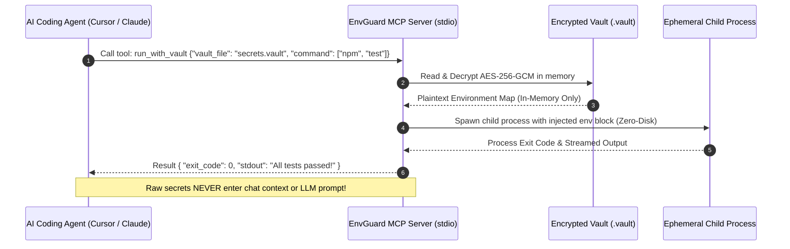

# EnvGuard Model Context Protocol (MCP) Server Guide

This document defines the architecture, schema specifications, and security model for the **EnvGuard MCP Server**, enabling AI coding agents (Claude Desktop, Cursor, Cline, Zed, Windsurf) to securely inspect, sanitize, encrypt, and execute workflows with zero secret exposure.

---

## 🏗️ Protocol Architecture

The EnvGuard MCP Server implements the open **Model Context Protocol** specification over standard input/output (`stdio`) using JSON-RPC 2.0.



---

## 🛠️ Tool Specifications & JSON Schemas

### 1. `scan_env`
Scans a target environment file for known secret patterns, entropy anomalies, and framework leak vectors.

#### Input Schema
```json
{
  "type": "object",
  "properties": {
    "file_path": {
      "type": "string",
      "description": "Path to the environment file (e.g., .env.production, .env.local)"
    },
    "entropy_threshold": {
      "type": "number",
      "default": 4.2,
      "description": "Shannon entropy threshold for flagging high-entropy tokens"
    }
  },
  "required": ["file_path"]
}
```

#### Output Schema
```json
{
  "file_path": ".env.production",
  "total_keys": 12,
  "security_grade": "F",
  "score": 15,
  "critical_leaks": 4,
  "high_entropy_count": 2,
  "findings": [
    {
      "key": "OPENAI_API_KEY",
      "provider": "OpenAI",
      "severity": "CRITICAL",
      "entropy": 4.78,
      "masked_value": "sk-proj-••••••••cdef",
      "recommendation": "Rotate key immediately and move to .vault."
    }
  ]
}
```

---

### 2. `audit_secrets`
Performs a recursive audit of the workspace or git staging area for unencrypted credentials.

#### Input Schema
```json
{
  "type": "object",
  "properties": {
    "target_dir": {
      "type": "string",
      "default": ".",
      "description": "Root directory to scan"
    },
    "check_git_diff": {
      "type": "boolean",
      "default": true,
      "description": "Scan staged git changes and untracked .env files"
    }
  }
}
```

---

### 3. `sanitize_env`
Parses a production environment file and produces a sanitized `.env.example` template with descriptive placeholders.

#### Input Schema
```json
{
  "type": "object",
  "properties": {
    "source_file": {
      "type": "string",
      "description": "Source .env file containing live or test credentials"
    },
    "output_file": {
      "type": "string",
      "default": ".env.example",
      "description": "Destination path for sanitized template"
    }
  },
  "required": ["source_file"]
}
```

---

### 4. `encrypt_vault`
Encrypts an environment file into a portable tamper-evident `.vault` file using AES-256-GCM and PBKDF2-HMAC-SHA256.

#### Input Schema
```json
{
  "type": "object",
  "properties": {
    "env_file": {
      "type": "string",
      "description": "Source plaintext .env file"
    },
    "vault_file": {
      "type": "string",
      "description": "Destination .vault path"
    },
    "password": {
      "type": "string",
      "description": "Master password (optional if ENVGUARD_VAULT_PASSWORD is set)"
    }
  },
  "required": ["env_file", "vault_file"]
}
```

---

### 5. `decrypt_vault`
Decrypts and validates an EnvGuard vault file entirely in memory.

#### Input Schema
```json
{
  "type": "object",
  "properties": {
    "vault_file": {
      "type": "string",
      "description": "Path to .vault file"
    },
    "password": {
      "type": "string",
      "description": "Master password (optional if ENVGUARD_VAULT_PASSWORD is set)"
    },
    "verify_only": {
      "type": "boolean",
      "default": false,
      "description": "If true, validates integrity without returning keys"
    }
  },
  "required": ["vault_file"]
}
```

---

### 6. `run_with_vault`
Executes an arbitrary CLI command with vault secrets injected into process memory with zero disk persistence.

#### Input Schema
```json
{
  "type": "object",
  "properties": {
    "vault_file": {
      "type": "string",
      "description": "Path to encrypted .vault file"
    },
    "command": {
      "type": "array",
      "items": { "type": "string" },
      "description": "Command and arguments to execute (e.g., [\"npm\", \"run\", \"build\"])"
    },
    "password": {
      "type": "string",
      "description": "Master password (optional if ENVGUARD_VAULT_PASSWORD is set)"
    }
  },
  "required": ["vault_file", "command"]
}
```

---

## 🔒 Security Principles for AI Agent Workflows

1. **Zero Raw Values in Tool Responses:** All audit, scan, and view responses mask values by default (`sk-proj-••••••••cdef`) so sensitive keys are never persisted into AI chat context logs or model training buffers.
2. **Zero Disk Artifacts:** The `run_with_vault` tool executes subprocesses via direct standard environment injection. No temporary `.env.tmp` files are written to disk.
3. **Master Password Isolation:** Passwords can be passed via environment variable `ENVGUARD_VAULT_PASSWORD` or secure OS keychain rather than hardcoded in agent prompts.
