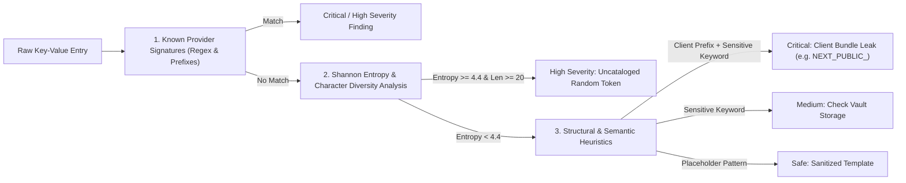

# EnvGuard Secret Patterns & Detector Catalog

This catalog documents the **50+ cryptographic secret patterns, provider signatures, entropy rules, and structural leak detectors** supported by EnvGuard.

---

## 📐 Detection Methodology

EnvGuard utilizes a tiered 3-stage detection pipeline:



---

## 🧠 Shannon Entropy Formula & Thresholds

EnvGuard measures the information density of secret values using Shannon Entropy:

$$H(X) = -\sum_{i=1}^{n} P(x_i) \log_2 P(x_i)$$

Where $P(x_i)$ is the probability of character $x_i$ appearing in value string $X$.

### Entropy Threshold Matrix

| Entropy ($H$) | String Length | Classification | Action |
| :--- | :--- | :--- | :--- |
| **$H \ge 4.6$** | $\ge 24$ chars | **CRITICAL** | High probability of cryptographic key / Base64 / Hex token. |
| **$4.0 \le H < 4.6$** | $\ge 16$ chars | **HIGH** | Likely API token or hashed identifier. |
| **$3.0 \le H < 4.0$** | Any | **MEDIUM / LOW** | Natural language, URLs, hostnames, or simple phrases. |
| **$H < 3.0$** | Any | **SAFE** | Constant values, booleans, ports, environment names. |

---

## 📋 Comprehensive Signature Catalog

### 1. AI & Machine Learning Platforms

| Provider | Signature Name | Regex Pattern / Format | Severity |
| :--- | :--- | :--- | :--- |
| **OpenAI** | Project API Key | `sk-proj-[A-Za-z0-9_\-]{48,}` | `CRITICAL` |
| **OpenAI** | Legacy User Key | `sk-[A-Za-z0-9]{32,48}` | `CRITICAL` |
| **OpenAI** | Organization Key | `sk-org-[A-Za-z0-9_\-]{32,48}` | `CRITICAL` |
| **Anthropic** | Claude API Key | `sk-ant-api\d\d-[A-Za-z0-9_\-]{80,}` | `CRITICAL` |
| **Hugging Face** | User Access Token | `hf_[a-zA-Z0-9]{34,}` | `HIGH` |
| **Cohere** | Production API Key | `[A-Za-z0-9]{40}` (Key matching `COHERE_API_KEY`) | `HIGH` |
| **Pinecone** | Vector DB Key | `[0-9a-f]{8}-[0-9a-f]{4}-[0-9a-f]{4}-[0-9a-f]{4}-[0-9a-f]{12}` | `MEDIUM` |
| **Replicate** | API Token | `r8_[a-zA-Z0-9]{37}` | `HIGH` |

---

### 2. Cloud Infrastructure & Hosting

| Provider | Signature Name | Regex Pattern / Format | Severity |
| :--- | :--- | :--- | :--- |
| **AWS** | Access Key ID | `AKIA[0-9A-Z]{16}` | `CRITICAL` |
| **AWS** | Secret Access Key | `[A-Za-z0-9\/+=]{40}` (Key matching `AWS_SECRET_ACCESS_KEY`) | `CRITICAL` |
| **AWS** | Session Token | `AQoDYXdzE...` (400+ chars Base64) | `HIGH` |
| **Google Cloud** | API Key | `AIza[0-9A-Za-z-_]{35}` | `HIGH` |
| **Google Cloud** | OAuth Client Secret | `GOCSPX-[0-9A-Za-z-_]{28}` | `HIGH` |
| **Google Cloud** | Service Account JSON | `"type": "service_account"` + `"private_key_id"` | `CRITICAL` |
| **Azure** | Connection String | `DefaultEndpointsProtocol=https;AccountName=...;AccountKey=` | `CRITICAL` |
| **Cloudflare** | API Token | `[A-Za-z0-9_-]{40}` (Key matching `CLOUDFLARE_API_TOKEN`) | `HIGH` |
| **Vercel** | Access Token | `[a-zA-Z0-9]{24}` (Key matching `VERCEL_TOKEN`) | `HIGH` |
| **Netlify** | Personal Access Token | `nfp_[a-zA-Z0-9]{40,64}` | `HIGH` |

---

### 3. Payment Gateways & Commerce

| Provider | Signature Name | Regex Pattern / Format | Severity |
| :--- | :--- | :--- | :--- |
| **Stripe** | Live Secret Key | `sk_live_[0-9a-zA-Z]{24,34}` | `CRITICAL` |
| **Stripe** | Live Restricted Key | `rk_live_[0-9a-zA-Z]{24,34}` | `CRITICAL` |
| **Stripe** | Webhook Signing Secret | `whsec_[0-9a-zA-Z]{32}` | `HIGH` |
| **Square** | Production Access Token | `sq0atp-[0-9A-Za-z\-_]{22}` | `CRITICAL` |
| **PayPal** | Secret Token | Key matching `PAYPAL_SECRET` + high entropy | `HIGH` |

---

### 4. Developer Tools & Version Control

| Provider | Signature Name | Regex Pattern / Format | Severity |
| :--- | :--- | :--- | :--- |
| **GitHub** | Classic PAT | `ghp_[A-Za-z0-9]{36}` | `CRITICAL` |
| **GitHub** | Fine-Grained PAT | `github_pat_[A-Za-z0-9_]{82}` | `CRITICAL` |
| **GitHub** | OAuth Access Token | `gho_[A-Za-z0-9]{36}` | `CRITICAL` |
| **GitHub** | Refresh Token | `ghr_[A-Za-z0-9]{36}` | `CRITICAL` |
| **GitLab** | Personal Access Token | `glpat-[0-9a-zA-Z\-]{20}` | `CRITICAL` |
| **NPM** | Automation Token | `npm_[A-Za-z0-9]{36}` | `CRITICAL` |
| **Docker Hub** | Personal Access Token | `dckr_pat_[A-Za-z0-9-_]{27}` | `HIGH` |

---

### 5. Messaging, Comms & Auth

| Provider | Signature Name | Regex Pattern / Format | Severity |
| :--- | :--- | :--- | :--- |
| **Slack** | Bot User Token | `xoxb-[0-9]{11,13}-[0-9]{11,13}-[a-zA-Z0-9]{24}` | `CRITICAL` |
| **Slack** | User Token | `xoxp-[0-9]{11,13}-[0-9]{11,13}-[a-zA-Z0-9]{24}` | `CRITICAL` |
| **Slack** | Incoming Webhook | `https:\/\/hooks\.slack\.com\/services\/T[0-9A-Z]+\/B[0-9A-Z]+\/[0-9A-Za-z]{24}` | `HIGH` |
| **SendGrid** | API Key | `SG\.[A-Za-z0-9_\-]{22}\.[A-Za-z0-9_\-]{43}` | `CRITICAL` |
| **Resend** | API Key | `re_[a-zA-Z0-9]{8,}_[a-zA-Z0-9]{24,}` | `HIGH` |
| **Twilio** | Account SID | `AC[a-f0-9]{32}` | `MEDIUM` |
| **Twilio** | Auth Token | `[a-f0-9]{32}` (Key matching `TWILIO_AUTH_TOKEN`) | `CRITICAL` |
| **Supabase** | Service Role Secret | `eyJhbGciOiJIUzI1NiIsInR5cCI6IkpXVCJ9\.[A-Za-z0-9_-]+\.[A-Za-z0-9_-]+` | `CRITICAL` |
| **PostgreSQL** | Connection URI with Pass | `postgres(ql)?:\/\/[^:]+:([^@]+)@` | `CRITICAL` |
| **MongoDB** | Connection URI with Pass | `mongodb(\+srv)?:\/\/[^:]+:([^@]+)@` | `CRITICAL` |
| **Redis** | Auth URI with Pass | `rediss?:\/\/[^:]+:([^@]+)@` | `CRITICAL` |
| **SSH / RSA** | Private Keys | `-----BEGIN (RSA\|EC\|OPENSSH\|DSA\|PRIVATE) KEY-----` | `CRITICAL` |

---

## 🚨 Client-Side Bundle Leak Detection

Modern frontend frameworks automatically inject environment variables into public client bundles based on key naming prefixes. EnvGuard flags any key combining a client-public prefix with sensitive substrings:

### Target Prefixes
- `NEXT_PUBLIC_` (Next.js)
- `VITE_` (Vite / React / Vue)
- `REACT_APP_` (Create React App)
- `PUBLIC_` (Astro / Remix)
- `GATSBY_` (Gatsby)

### Sensitive Substring Triggers
`SECRET`, `KEY`, `PASSWORD`, `PASS`, `TOKEN`, `AUTH`, `CREDENTIAL`, `PRIVATE`, `ADMIN`

**Example Finding:**
```ini
NEXT_PUBLIC_SUPABASE_SERVICE_ROLE_KEY=eyJhbGciOiJIUzI1Ni...
# ⚠️ TRIGGER: Critical Severity! Service role key bypassed row-level security and is exposed to browser.
```

---

## 🛡️ False Positive Suppression

EnvGuard automatically classifies values as **SAFE** placeholders if they match recognized template conventions:
- Prefixes: `your-`, `your_`, `placeholder_`, `todo_`, `change_me_`, `xxx`, `<insert_`
- Substrings: `EXAMPLE`, `localhost`, `0.0.0.0`, `127.0.0.1`, `test_key`, `development`
- Empty values: `KEY=`
