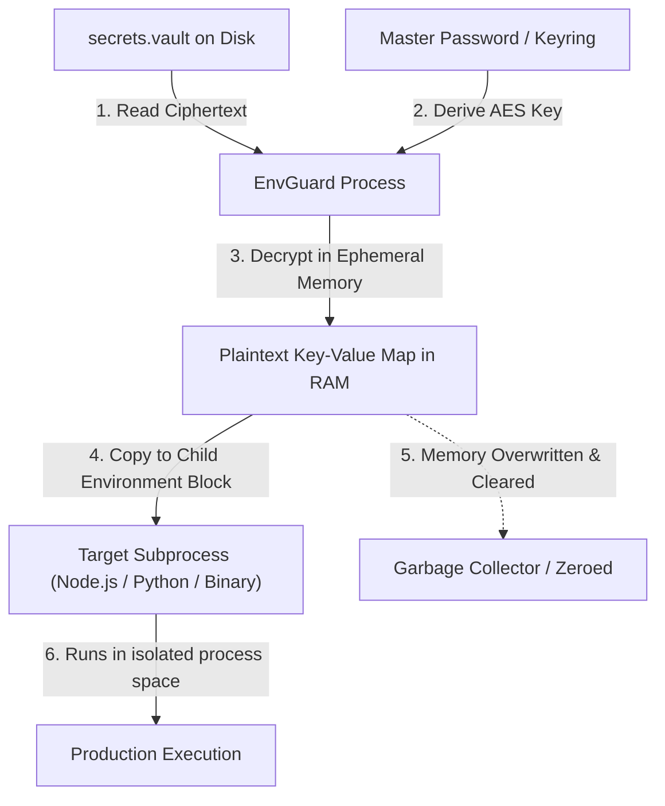

# EnvGuard Zero-Exposure Vault Architecture & Cryptographic Specification

This document details the cryptographic principles, envelope format, threat model, and execution engine powering **EnvGuard's Zero-Exposure Encrypted Vault**.

---

## 🔐 Cryptographic Primitives & Specifications

EnvGuard is built exclusively with NIST-approved, industry-standard cryptographic algorithms:

| Component | Standard Primitive | Specification / Parameters |
| :--- | :--- | :--- |
| **Symmetric Cipher** | `AES-256-GCM` | 256-bit key length, 96-bit random IV, 128-bit authentication tag (`tag`) |
| **Key Derivation (KDF)** | `PBKDF2-HMAC-SHA256` | 100,000+ iterations (Web Crypto), 600,000 iterations (CLI), 128-bit salt |
| **Random Number Generation** | CSPRNG | `os.urandom` (Python) / `crypto.getRandomValues` (Web Crypto) |
| **Payload Envelope** | JSON | Self-describing, deterministic base64 fields |

---

## 📦 Envelope Schema Specification (`envguard-vault-v1`)

```json
{
  "$schema": "https://envguard.dev/schemas/vault-v1.json",
  "version": 1,
  "format": "envguard-vault-v1",
  "cipher": "AES-256-GCM",
  "kdf": "PBKDF2-HMAC-SHA256",
  "kdf_iterations": 100000,
  "salt": "<base64-encoded 16 bytes>",
  "iv": "<base64-encoded 12 bytes>",
  "ciphertext": "<base64-encoded encrypted payload>",
  "tag": "<base64-encoded 16 bytes auth tag>",
  "created_at": "2026-09-16T18:30:00Z",
  "key_count": 9
}
```

### Integrity & Tamper Detection
AES-GCM is an **Authenticated Encryption with Associated Data (AEAD)** scheme. If an adversary modifies even a single bit of the `ciphertext`, `iv`, `salt`, or `tag`, the GCM verification fails during `aesgcm.decrypt()` and execution immediately raises an authentication error before any unverified plaintext is processed.

---

## ⚙️ Zero-Disk Execution Engine (`envguard vault run`)

Traditional secret managers frequently write decrypted `.env` files to `/tmp` or the project root before launching a command. This exposes credentials to:
1. Disk forensic recovery.
2. Accidental inclusion in git commits or Docker build contexts.
3. Other unprivileged processes inspecting `/tmp`.

EnvGuard completely bypasses disk storage using **direct process environment inheritance**:



---

## 🛡️ Threat Model & Security Properties

### Protected Against:
- **Accidental Repository Commits:** `.vault` files are fully encrypted with AES-256-GCM and safe for version control.
- **Client-Side Bundle Leaks:** Detects frontend framework prefix misuse (e.g. `NEXT_PUBLIC_`) before production builds.
- **Disk Forensics:** Secrets are injected directly into OS process environments and never touch storage drives.
- **Tampering & Bit-Flipping:** AES-GCM 128-bit authentication tags ensure mathematical tamper evidence.
- **Offline Dictionary Attacks:** High-iteration PBKDF2-HMAC-SHA256 makes brute-force attacks computationally prohibitive.

### Out of Scope:
- Compromised root/kernel-level OS with memory dumping tools attached to the running child process.
- Stolen master password via keylogger.

---

## 📊 Comparison Matrix

| Feature | EnvGuard Vault | HashiCorp Vault | Doppler | dotenv-vault |
| :--- | :--- | :--- | :--- | :--- |
| **Self-Contained (0 Servers)** | ✅ Yes (Local/Git) | ❌ Requires Daemon | ❌ Cloud Only | ❌ Cloud Backend |
| **Zero Disk Write (`vault run`)** | ✅ Yes | ✅ Yes (with agent) | ✅ Yes | ❌ Writes to disk |
| **Native Web Studio UI** | ✅ 100% Client-side | ⚠️ Server UI | ⚠️ SaaS Web | ❌ CLI only |
| **AI Agent MCP Integration** | ✅ Built-in 6 Tools | ❌ Manual plugin | ❌ Third party | ❌ No |
| **Entropy & Prefix Auditor** | ✅ Built-in 50+ | ❌ No | ❌ No | ❌ No |
| **Air-Gapped / Offline** | ✅ 100% Offline | ⚠️ Self-hosted | ❌ No | ❌ No |
